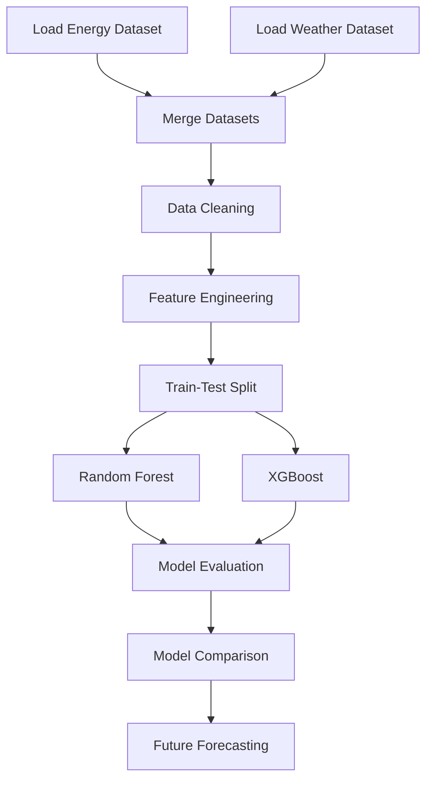

#  Energy Consumption Forecasting Using Machine Learning

> **Hourly Electricity Demand Prediction Using Weather Data, Feature Engineering, Random Forest, and XGBoost**


# Project Overview

This project forecasts hourly electricity consumption using historical energy demand and weather data. After preprocessing and feature engineering, **Random Forest** and **XGBoost** models were trained and compared using **MAE, RMSE, and R² Score**. The best-performing model was then used to generate future electricity demand forecasts through recursive prediction.


# Problem Statement

Electricity demand changes with weather conditions, seasonal patterns, and human activities. Accurate forecasting helps utilities optimize power generation, reduce operational costs, and improve grid reliability. This project predicts hourly electricity consumption using historical demand and weather data.


# Objectives

* Preprocess and merge energy and weather datasets.
* Perform feature engineering using lag and time-based features.
* Train **Random Forest** and **XGBoost** regression models.
* Evaluate model performance using **MAE, RMSE, and R² Score**.
* Compare both models and select the best-performing model.
* Forecast future hourly electricity consumption.


#  Technologies Used

| Technology | Purpose |
|------------|---------|
| **Python** | Programming language |
| **Pandas** | Data loading, preprocessing, and manipulation |
| **NumPy** | Numerical computations |
| **Matplotlib** | Data visualization |
| **Scikit-learn** | Random Forest model, preprocessing, train-test split, evaluation metrics |
| **XGBoost** | Gradient boosting regression model |
| **Jupyter Notebook** | Model development and experimentation |

# Installation guide and Requirement

```bash
git clone https://github.com/K-S-Patel/energy_demand_forecasting.git

cd Energy-Consumption-Forecasting

pip install -r requirements.txt

jupyter notebook
```


# Dataset

The project uses two datasets merged on hourly timestamps to create the final training dataset.

## 1. Energy Consumption Dataset

* **Region:** California (US)
* **Time Period:** January 2019 – April 2026
* **Target Variable:** California Consumption (MW)
* **Frequency:** Hourly

## 2. Weather Dataset

The weather dataset provides hourly environmental data corresponding to the energy consumption records.

**Features Used**

* Temperature
* Relative Humidity

## Final Dataset

The merged dataset combines energy consumption, weather data, and engineered features for model training and forecasting.


### Features Used for Training

| Feature | Description |
|---------|-------------|
| Temperature | Hourly temperature |
| RelativeHumidity | Hourly relative humidity |
| Lag_1H | Electricity consumption one hour earlier |
| Lag_1D | Electricity consumption one day earlier |
| Lag_1W | Electricity consumption one week earlier |
| Hour | Hour of the day (0–23) |
| DayOfWeek | Day of the week (0–6) |
| Month | Month of the year |
| IsWeekend | Indicates whether the day is a weekend |
| California_consumption_MW | Target variable (electricity demand) |

# Project Workflow

The overall workflow of the project is illustrated below.



---

<details>
<summary><b>Step 1: Import Required Libraries</b></summary>

| Library | Purpose |
|----------|---------|
| **Pandas** | Data loading and preprocessing |
| **NumPy** | Numerical computations |
| **Scikit-learn** | Random Forest, train-test split, evaluation metrics |
| **XGBoost** | Gradient boosting regression model |
| **Matplotlib** | Data visualization |

</details>

---

<details>
<summary><b>Step 2: Load Energy Dataset</b></summary>

- Loaded yearly and monthly California electricity demand datasets.
- Combined all Excel files into a single DataFrame.

</details>

---

<details>
<summary><b>Step 3: Merge Energy Data</b></summary>

- Merged all yearly energy datasets into one dataset.
- Exported the merged dataset as **Energy_Consumption_2019_April2026.xlsx**.

</details>

---

<details>
<summary><b>Step 4: Inspect & Prepare Datasets</b></summary>

- Verified dataset structure using `head()` and `info()`.
- Converted **Date** and **HR** into a complete hourly timestamp.
- Loaded and verified the weather dataset.

</details>

---

<details>
<summary><b>Step 5: Merge Energy & Weather Datasets</b></summary>

- Merged both datasets using the common datetime column.
- Applied an **inner join** to retain matching hourly records.
- Stored the merged dataset in **final_df**.

</details>

---

<details>
<summary><b>Step 6: Data Cleaning</b></summary>

- Removed unnecessary columns.
- Renamed **SCE** to **California_Consumption_MW**.
- Saved the cleaned dataset for model development.

</details>

---

<details>
<summary><b>Step 7: Feature Engineering</b></summary>

- Created lag features (**Lag_1H, Lag_1D, Lag_1W**).
- Extracted **Hour, DayOfWeek, Month,** and **IsWeekend** features.
- Removed rows containing null values generated by lag features.

  


</details>

---

<details>


## Model Selection

Two ensemble learning models were selected to forecast hourly electricity consumption.

### Random Forest Regressor

- Uses the **Bagging** technique.
- Handles nonlinear relationships effectively.
- Reduces overfitting and performs well on structured datasets.

### XGBoost Regressor

- Uses the **Gradient Boosting** technique.
- Provides higher prediction accuracy through sequential learning.
- Includes regularization to improve generalization and reduce overfitting.

</details>
---

<details>
<summary><b>Step 8: Train-Test Split</b></summary>

- Selected all engineered features as input variables.
- Used **California_Consumption_MW** as the target variable.
- Split the dataset into **80% training** and **20% testing** data.
- Set `shuffle=False` to preserve chronological order.

</details>

---

<details>
<summary><b>Step 9: Model Training</b></summary>

- Trained both **Random Forest** and **XGBoost** models.
- Configured suitable hyperparameters for energy demand forecasting.
- Saved the trained models for evaluation.

</details>

---
<details>
<summary><b>Step 10: Generate Predictions</b></summary>

- Generated predictions on the testing dataset using both models.
- Stored predictions for performance evaluation and comparison.

</details>

---

<details>
<summary><b>Step 11: Model Evaluation</b></summary>

The trained models were evaluated using:

- **MAE (Mean Absolute Error)**
- **RMSE (Root Mean Squared Error)**
- **R² Score**

These metrics were used to compare the prediction accuracy of both models.

</details>

---

<details>
<summary><b>Step 12: Model Performance Comparison</b></summary>

- Compared Random Forest and XGBoost using **MAE, RMSE, and R² Score**.
- **XGBoost** achieved the best overall performance and was selected as the final forecasting model.

  


</details>

---

<details>
<summary><b>Step 13: Prediction Comparison</b></summary>

- Compared actual energy consumption with predictions from both models.
- Calculated prediction error and absolute error for each model.

  


</details>

---

<details>
<summary><b>Step 14: Data Visualization</b></summary>

Visualized historical electricity consumption using:

- Daily Trend


  
- Weekly Average Trend


  
- Monthly Average Trend

  


</details>

---

<details>
<summary><b>Step 15: Actual vs Predicted Results</b></summary>

- Plotted actual and predicted electricity consumption.
- Compared prediction trends of Random Forest and XGBoost.
- Verified how closely each model followed the real consumption pattern.

  


</details>

---

# Future Energy Forecasting

> **Note:** Historical energy consumption data was available only until **April 2026**. Future forecasting was performed for **May–August 2026** using forecasted weather data and the trained model.

---

<details>
<summary><b>Step 16: Prepare Future Input Data</b></summary>

- Loaded the future weather dataset.
- Generated **Hour, DayOfWeek, Month,** and **IsWeekend** features.
- Prepared the dataset for future energy demand prediction.

</details>

---

<details>
<summary><b>Step 17: Future Energy Prediction</b></summary>

- Generated recursive lag features using historical and predicted values.
- Predicted hourly electricity demand using the trained **XGBoost** model.
- Stored the predicted values for the complete forecasting period.

</details>

---

<details>
<summary><b>Step 18: Future Forecast Visualization</b></summary>

- Visualized predicted electricity demand from **May–August 2026**.
- Short-term forecasts closely followed expected demand patterns.
- Prediction accuracy gradually decreased over longer periods due to recursive forecasting.

  


</details>

---

## Forecast Observation

Recursive forecasting produced reliable predictions during the initial forecast period. However, as the model relied on previously predicted values to generate new lag features, forecasting errors gradually accumulated, resulting in reduced accuracy for long-term predictions.

---
---

# 📈 Results & Key FindingsModel Performance: 
XGBoost outperformed the Random Forest Regressor across metrics, demonstrating superior $R^2$ accuracy and a lower RMSE value when learning complex non-linear relationships.Trend Alignment: Visual evaluation confirmed that predictions closely matched real daily peaks, weekly cycles, and monthly seasonality shifts.Future Demand Forecasting: Successfully generated hourly future electricity demand projections for May–August 2026.
## 💡 Observation on Future Forecasts: While short-term recursive forecasts (May–June 2026) yielded accurate baseline trends, long-range predictions (July–August 2026) showed error compounding due to relying heavily on previously predicted lag values rather than ground-truth historical inputs.


# 🚀 Future Improvements
- Evaluate deep learning models such as **LSTM** and **Transformer** for long-term forecasting.
- Develop a web-based dashboard for real-time energy demand prediction and visualization.

# Conclusion

This project demonstrates that machine learning can effectively forecast hourly electricity consumption using historical demand, weather conditions, and engineered time-series features. Among the evaluated models, **XGBoost** delivered the best overall performance and was selected as the final forecasting model. The proposed approach provides reliable short-term forecasts that can support energy planning and decision-making.
